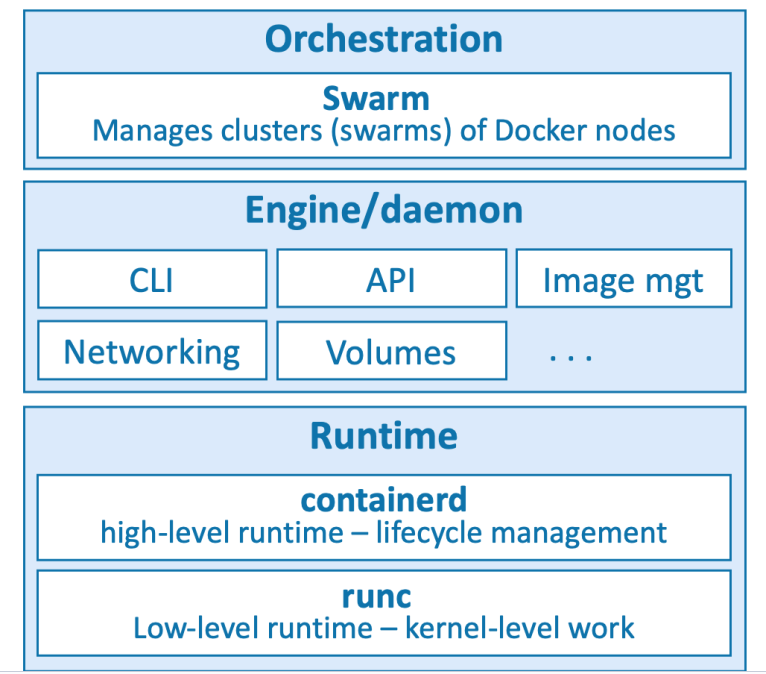

# Docker
Docker is software that runs on Linux and Windows. It creates, manages, and can even orchestrate containers. 
Docker has three integral components, _the runtime_, _the daemon_ and the _orchestrator_.



## The Runtime
The runtime operates at the lowest level and is responsible for starting and stopping containers 
(this includes building all of the OS constructs such as namespaces and
cgroups). Docker implements a tiered runtime architecture with high-level and lowlevel runtimes that work together.
The low-level runtime is called _runc_ and is the reference implementation of Open
Containers Initiative (OCI) runtime-spec. Its job is to interface with the underlying OS
and start and stop containers. Every container on a Docker node was created and started
by an instance of *runc*.\
The higher-level runtime is called containerd. This manages the entire container lifecycle including pulling images and managing runc instances. containerd is pronounced
_container-dee_ and is a graduated **CNCF** project used by Docker and Kubernetes.
A typical Docker installation has a single long-running containerd process instructing
runc to start and stop containers. _runc_ is never a long-running process and exits as soon
as a container is started

## The daemon
The Docker daemon (dockerd) sits above containerd and performs higher-level tasks
such as exposing the Docker API, managing images, managing volumes, managing
networks, and more…A major job of the Docker daemon is to provide an easy-to-use standard interface that
abstracts the lower levels.

## Running a container
Understand that the running state of a container is directly tied to the state of a single running program inside
the container. If a program is running, the container is running. If the program is stopped, the container is stopped.
Restarting a container will run the program again.

## Major System Features Used by Docker
Docker uses several features of the Linux kernel to provide its functionality. These features include:
- `PID namespace—Process identifiers and capabilities`
- `UTS namespace—Host and domain name`
- `MNT namespace—Filesystem access and structure`
- `IPC namespace—Process communication over shared memory`
- `NET namespace—Network access and structure`
- `USR namespace—User names and identifiers`
- `chroot syscall—Controls the location of the filesystem root`
- `cgroups—Resource protection`
- `CAP drop—Operating system feature restrictions`
- `Security modules—Mandatory access controls`

### Getting Help in the command line
Use the `--help` flag to get help on a command.\
```bash
docker help
docker help <command>
docker <command> --help
```
